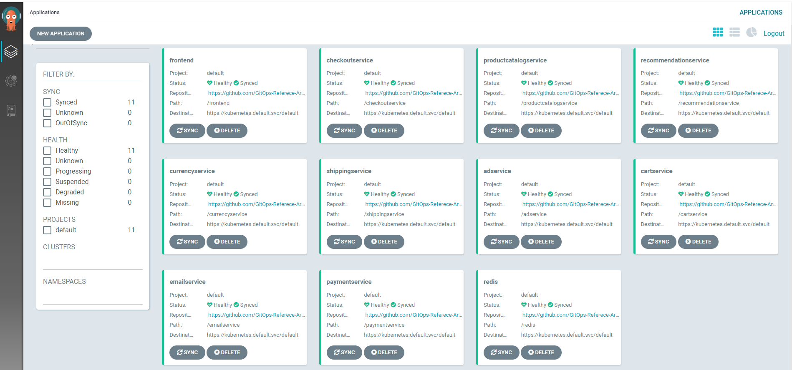

# Bootstrap Argo CD Cluster using Tekton Pipelines

There are many ways to deploy an application that consists of a lot of microservices with Argo CD. For example, you can use the [**apps of apps** pattern](https://argoproj.github.io/argo-cd/operator-manual/cluster-bootstrapping/).

In this repo, we show you how to deploy the [Hipster Shop](https://github.com/GoogleCloudPlatform/microservices-demo) microservices sample application using a Tekton Pipeline. 

The following is the architecture diagram of the Hipster Shop microservices application.  


As in typical microservices applications, you can see complex dependencies in the architeture diagram. To deploy the entire application in an automatic manner, you have to ensure that depenenting apps/services has to be deployed first and in ready to serve status before you can deploy dependent apps/services. For instance, Cache (redis) has to be deployed and ready befoer yuo can deploy the CartService. Similarly, _Frontend_ depends on a lot of applications, some of its depending applications, such as the _CheckoutService_, in turn, depends on a few other services (e.g., _EmailService_, _PaymentService_, and _ShippingService_). 

Tekton Pipeline's upport for _Directed Acyclic Graph_ or _DAG_ provides semantics such as _runAfter_ or _from_ that enables you to control dependencies. In addition, Argo CD CLI comes with a _wait_ command with a _--heath_ flag which you can use to make sure the depending service is ready to serve before you deploy the dependent service.

The Tekton Pipeline (_bootstrap-microservices-pipeline_) in this repo repeatly calls a resuable Task (_argocd-sync-app-task_) and uses _runAfter_ to specify dependencies for each app/service.

The Tekton Task contains four steps with each step executes a particular Argo CD CLI command:
1. The first step logins to an Argo CD server with the `argocd login` command.
2. The second step adds the (configuration) github repo (a helm chart, for example to the Argo CD cluster with the `argocd repo add` command.
3. The third step creates the Argo CD application by calling the `argocd app create` command.
4. The last step executes the `argocd wait` command with a `--health` flag to wait for the application becomes healthy and ready to serve before moving on.

To install the `Hipster Shop` microservices application using this repo, follow these steps:  
1. Replace ALL CAPS place holders in `task-argocd-syn-app.yaml` with appropriate values.
2. Run the following command from a bash shell:
```
$ kubectl apply -f task-argocd-sync-app.yaml
$ kubectl apply -f pipeline.yaml
$ kubectl create -f pipelinerun.yaml
```
Once the Pipelinerun completes successfully, you should see all the apps/servcies are deployed as healthy Argo CD applications in Argo CD web UI:



At this point, you are ready to test the frontend application:


